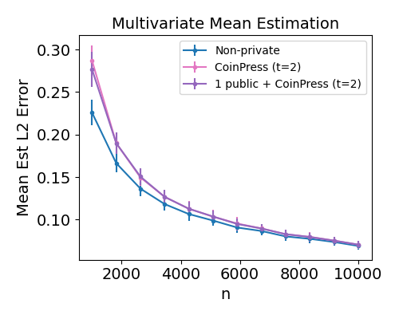
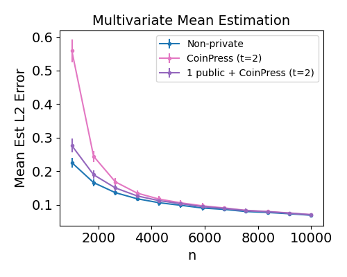
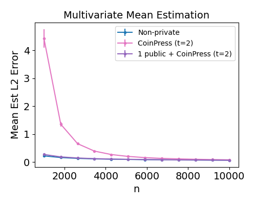
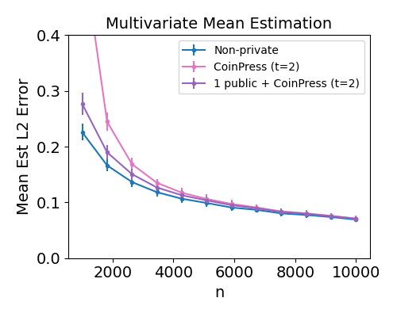
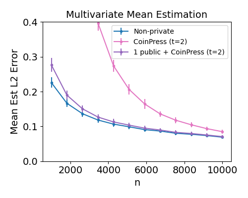

# Private mean estimation with 1 public sample

A proof-of-concept numerical simulation demonstrating the effectiveness of _1 public sample_ in private mean estimation.

This code is referenced in our NeurIPS 2022 paper:

[Private Estimation with Public Data](https://arxiv.org/abs/2208.07984) by Alex Bie*, Gautam Kamath*, Vikrant Singhal* (*alphabetical order).

## Running the code
Tested on Python 3.10.0.
- Install required packages: `pip install -r requirements.txt`
- Reproduce the figures in the paper: `python run.py` 
- Figures will be dumped into `./plots/*.png`

## Results

Targeting zCDP at ρ = 0.5, we examine the effect of 1 public sample on CoinPress (an existing private mean estimator) on n samples from N(k * [1,...,1]T, Id), d = 50. We use R = k*sqrt(d) as the a priori upper bound on the mean for CoinPress.

**Left to Right: k = 10, k = 100, k = 1000.** We see that 1 public sample significantly improves results when the a priori bound on the mean is weak (k is large).

**Left to Right: k = 100 (zoomed-in), k = 1000 (zoomed-in).** 

## Acknowledgements
This code makes heavy use of the original authors' [implementation of CoinPress](https://github.com/twistedcubic/coin-press).

See their paper for more details about CoinPress:

[CoinPress: Practical Private Mean and Covariance Estimation](https://arxiv.org/abs/2006.06618) by Sourav Biswas, Yihe Dong, Gautam Kamath, Jonathan Ullman. 
